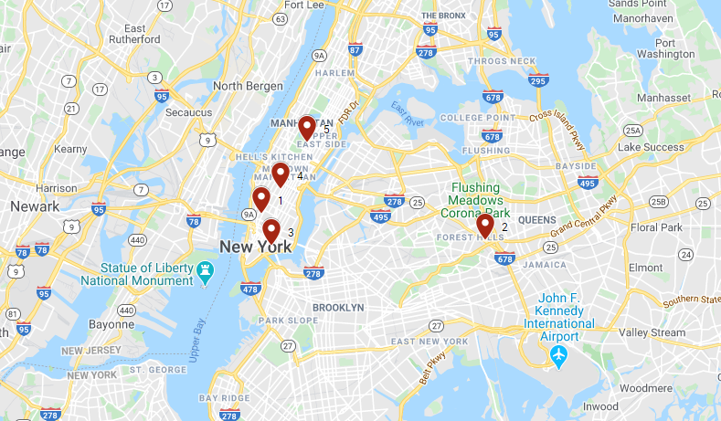

# Advanced Database Systems: Pyspark implementation of the k-means algorithm using HDFS
This repository hosts the programming exercise for the course Advanced Database Systems of NTUA ECE.

## About the project
The goal of this project was to implement the k-means clustering algorithm, using [Hadoop File System](https://hadoop.apache.org/) and [Pyspark](https://spark.apache.org/), in order to classify the pick-up locations of the [Yellow Taxi Trip Data](https://data.cityofnewyork.us/Transportation/2015-Yellow-Taxi-Trip-Data/ba8s-jw6u) into five clusters and return the coordinates of their centroids.

## Data
For the purposes of this exercise we were given a subset of the [Yellow Taxi Trip Data](https://data.cityofnewyork.us/Transportation/2015-Yellow-Taxi-Trip-Data/ba8s-jw6u) of about 13 million trip records.

>**2015 Yellow Taxi Trip Data**: This dataset includes trip records from all trips completed in yellow taxis from in NYC from January to June in 2015.  Records include fields capturing pick-up and drop-off dates/times, pick-up and drop-off locations, trip distances, itemized fares, rate types, payment types, and driver-reported passenger counts. 

Our dataset includes only the following fields:
- ID
- Pickup datetime
- Dropoff datetime
- Pickup longitude
- Pickup latitude
- Dropff longitude
- Dropoff latitude
- Fare amount

e.g. 369367789289, 2015-03-27 18:29:39, 2015-03-27 19:08:28, -73.975051879882813, 40.760562896728516, -73.847900390625, 40.732685089111328, 34.8

Since we want to classify the pick-up locations, we are only going to keep the fields *Pickup longitude* and *Pickup latitude*. 

**Note**: We encountered a problem with this dataset as there were missing values in the coordinates of some pickup locations which lead to one of the centroids being located near the [Null Island](https://en.wikipedia.org/wiki/Null_Island). The missing values are represented with (0,0) coordinates in the dataset. Therefore we preprocessed the dataset in a way to keep only the valid coordinates for locations inside the USA.

## Distance function
In order to calculate the distances in the k-means algorithm we used the [Haversine formula](https://en.wikipedia.org/wiki/Haversine_formula) which:
> ...determines the great-circle distance between two points on a sphere given their longitudes and latitudes.

We used Michael Dunn's [implementation](https://stackoverflow.com/a/4913653) of the formula in python.

## Output
The coordinates of the clusters' centroids calculated by our program are the following:

| Cluster ID |      Longitude     |      Latitude      |
|:----------:|:------------------:|:------------------:|
|      1     | -74.00260317076881 |  40.7318785714756  |
|      2     |  -73.8345488581535 | 40.716365001986986 |
|      3     | -73.99472105165371 |  40.71362679703845 |
|      4     |  -73.9881326634434 |  40.74593388157429 |
|      5     | -73.96847815487313 |  40.77200165263602 |

### Visualization

